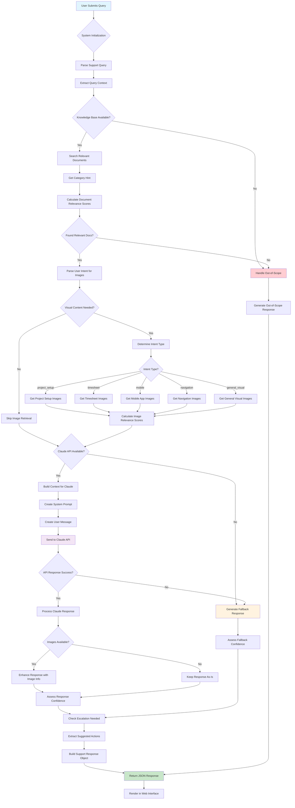

# Replicon AI Support System

An AI-powered support system that scrapes Replicon's documentation and provides intelligent responses using Claude AI.

## 🚀 Quick Start

1. **Install Dependencies**
   ```bash
   pip install -r requirements.txt
   ```

2. **Set up your Claude API Key**
   - Edit `.env` file
   - Replace `your_claude_api_key_here` with your actual Claude API key

3. **Copy HTML Template**
   - Copy the HTML template from the artifacts to `templates/support_home.html`

4. **Run the System**
   ```bash
   python run.py
   ```

## 📁 Project Structure

```
replicon-ai-support/
├── replicon_scraper.py      # Documentation scraper
├── support_system.py        # Main FastAPI application
├── run.py                   # Easy run script
├── config.py               # Configuration settings
├── requirements.txt        # Python dependencies
├── .env                    # Environment variables
├── templates/
│   └── support_home.html   # Web interface template
├── static/                 # Static files (CSS, JS)
├── docs/                   # Scraped documentation (JSON)
└── replicon_docs.db       # SQLite database
```

## 🛠️ Components

### 1. Documentation Scraper (`replicon_scraper.py`)
- Automatically discovers and scrapes Replicon help documentation
- Categorizes content intelligently
- Stores in SQLite database for fast searching
- Respects rate limits and robots.txt

### 2. AI Support System (`support_system.py`)
- FastAPI web application
- Claude AI integration for intelligent responses
- Context-aware responses based on user role and module
- Confidence scoring and escalation detection

### 3. Web Interface
- Clean, modern UI
- Real-time AI responses
- Suggested actions and relevant documentation
- Mobile-friendly design

## 📊 Features

- **Smart Documentation Scraping**: Automatically builds knowledge base
- **Context-Aware AI**: Responses tailored to user role and Replicon module
- **Confidence Scoring**: AI assesses its own response quality
- **Escalation Detection**: Identifies when human support is needed
- **Relevant Documentation**: Shows related help articles
- **Suggested Actions**: Provides actionable next steps
- **Search Functionality**: Direct documentation search
- **Analytics**: Track common issues and response quality

## 🔧 Configuration

Edit `config.py` to customize:
- Scraping behavior
- Claude AI settings
- Category definitions
- Response thresholds

## 🚦 Usage

1. **First Run**: The system will offer to scrape documentation
2. **Web Interface**: Visit https://repliconaisupport-5.onrender.com/
3. **Ask Questions**: Type natural language questions about Replicon
4. **Get AI Responses**: Receive intelligent, contextual answers

## 📈 Monitoring

- Check scraping statistics at `/stats` endpoint
- Monitor response quality and user satisfaction
- Track common issues for documentation improvements

## 🔐 Security

- API keys stored in environment variables
- Rate limiting on scraping
- Input validation and sanitization
- HTTPS ready for production

## 🤝 Contributing

1. Fork the repository
2. Create a feature branch
3. Make your changes
4. Test thoroughly
5. Submit a pull request

## 📝 License

MIT License - see LICENSE file for details

## 💡 Tips

- **Better Responses**: Include your role and specific Replicon module
- **Complex Issues**: Provide detailed context and steps already tried
- **Documentation**: Check the suggested documentation links for deeper info
- **Feedback**: Use confidence scores to gauge response reliability

## 🆘 Support

- Check the `/stats` endpoint for system health
- Review logs in the `logs/` directory
- For Claude API issues, check your API key and usage limits
- For scraping issues, verify the target website is accessible

---

Built with ❤️ using FastAPI, Claude AI, and modern web technologies.


